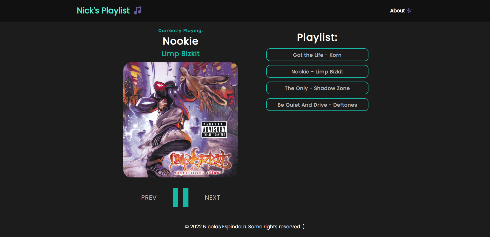

# Nick's Music Player

The project consists of a Music Player and was created to exercise my knowledge in Vue.JS. For this, different components and elements of Vue.JS were used in the code.
## Installation
1. Clone the repository.
2. Install the required dependencies by running npm install.
3. Start the application by running npm run serve.

### Customize configuration
See [Configuration Reference](https://cli.vuejs.org/config/).
